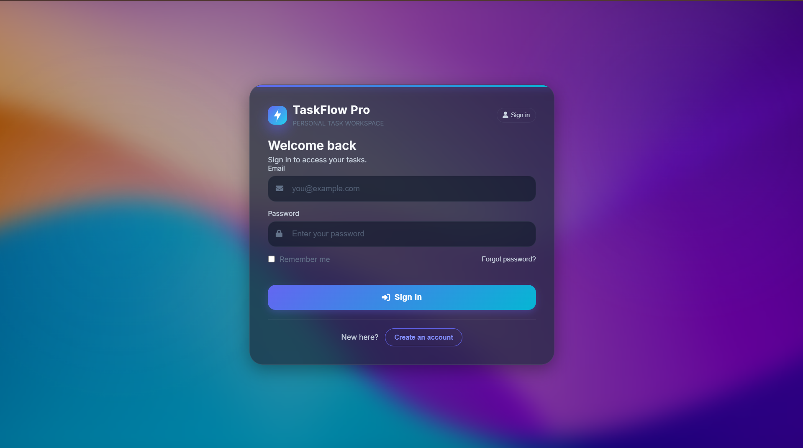
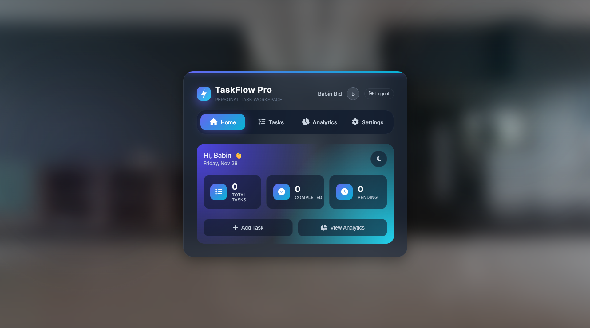
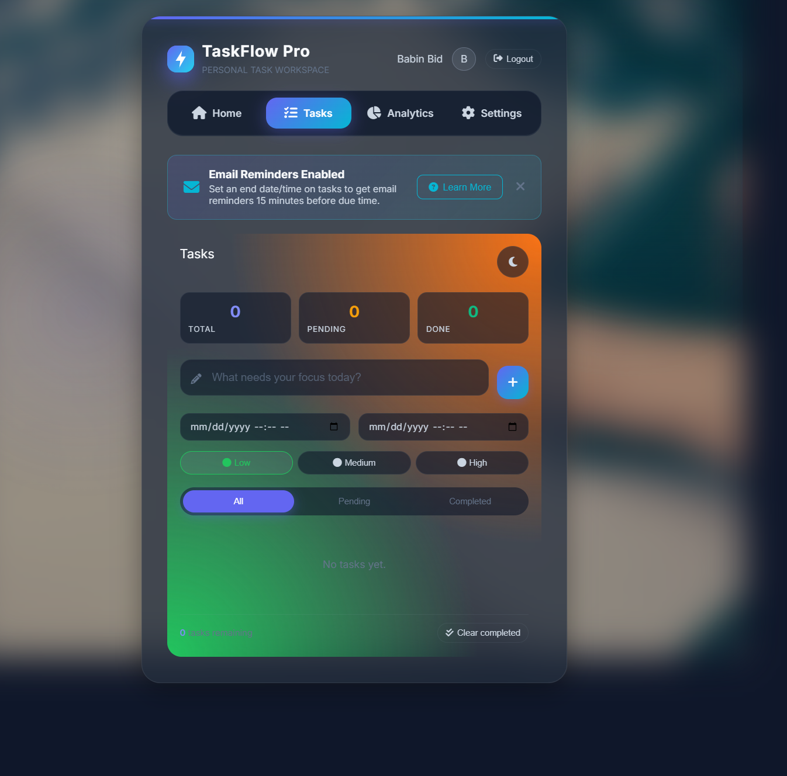
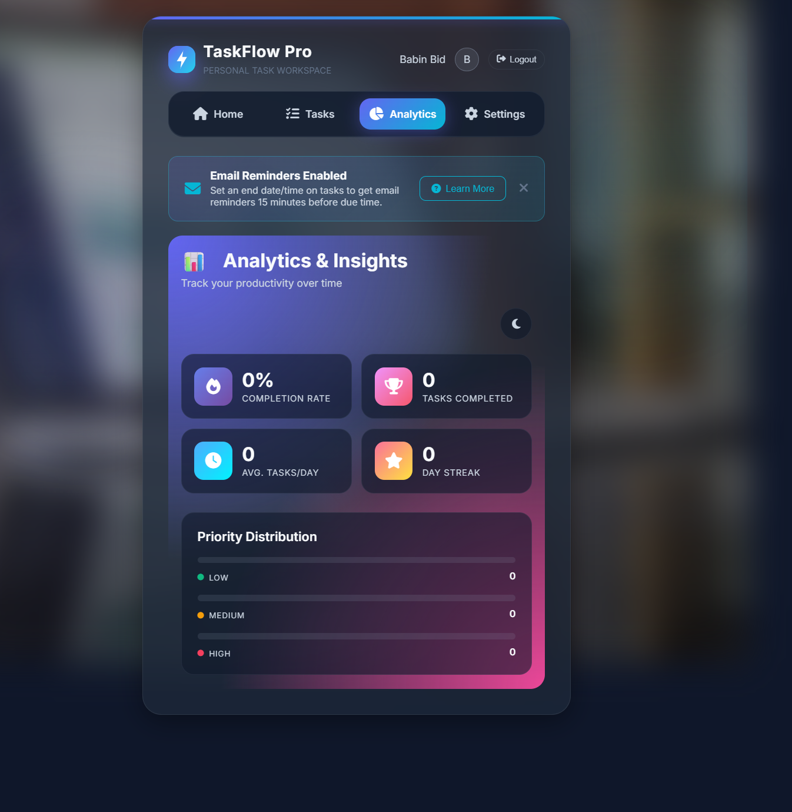
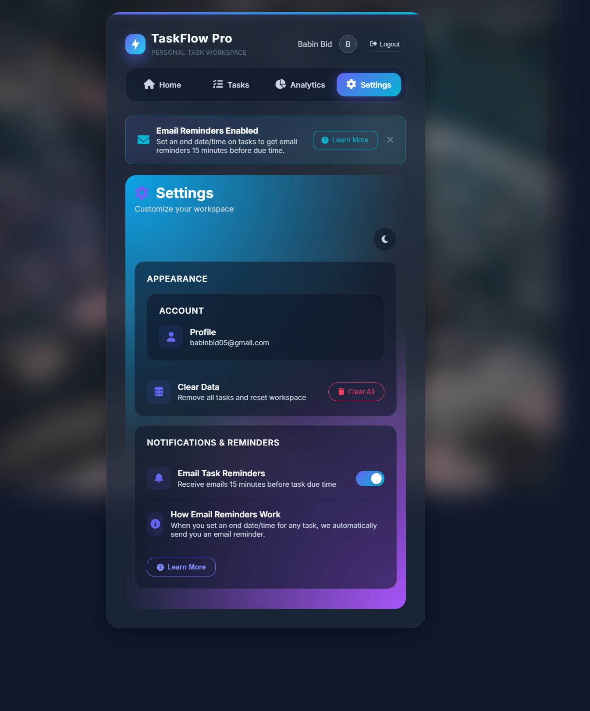

# TaskFlow Pro ✅

A modern, study-oriented task management application with a beautiful glassmorphism UI, email reminders, and comprehensive analytics.

> 📚 **Study Project** – Built by **Babin Bid** for learning and personal productivity.


## ✨ Features

### 🧩 Core Functionality
- **🗂️ Task Management** - Create, edit, delete, and complete tasks
- **🚦 Priority Levels** - Low, Medium, and High priority with visual indicators
- **📅 Date Scheduling** - Set start and end dates for tasks
- **🔎 Filtering** - View All, Pending, or Completed tasks
- **💾 Persistent Storage** - Tasks saved to localStorage per user

### 🎛️ User Experience
- **🎨 Beautiful UI** - Modern glassmorphism design with blur effects
- **🖼️ Dynamic Backgrounds** - Section-specific blurred background images
- **🌗 Dark/Light Theme** - Toggle between themes with smooth transitions
- **📱 Responsive Design** - Works seamlessly on desktop and mobile
- **⏳ Loading Animation** - Smooth app loader on startup

### 📊 Analytics & Insights
- **✅ Completion Rate** - Track your task completion percentage
- **🏆 Tasks Completed** - Total completed tasks counter
- **📈 Average Tasks/Day** - Daily productivity metric
- **🔥 Day Streak** - Consecutive days with task completions
- **📊 Priority Distribution** - Visual breakdown of task priorities

### ✉️ Email Reminders
- **⏰ Automated Reminders** - Get email notifications 15 minutes before task due time
- **🧾 Professional Templates** - Beautiful HTML email templates
- **🔁 Toggle Control** - Enable/disable email reminders in settings

### 🔐 Authentication
- **👥 User Accounts** - Sign up and sign in with email/password
- **📌 Remember Me** - Optional persistent sessions
- **🔒 Per-User Data** - Tasks are stored separately for each user

## 🚀 Getting Started

### 🧾 Prerequisites
- 🟢 [Node.js](https://nodejs.org/) (v18 or higher)
- 📦 npm (comes with Node.js)
- ✉️ Gmail account (for email reminders)

### 🛠️ Installation

1. **Clone the repository**
   ```bash
   git clone https://github.com/KGFCH2/ToDo_List.git
   cd ToDo_List
   ```

2. **Install dependencies**
   ```bash
   npm install
   ```

3. **🔑 Set up environment variables**
   
   Create a `.env` file in the root directory:
   ```env
   EMAIL_USER=your-email@gmail.com
   EMAIL_PASSWORD=your-app-password
   APP_URL=http://localhost:3000
   PORT=3000
   ```

   > **Note:** For Gmail, you need to use an [App Password](https://support.google.com/accounts/answer/185833), not your regular password. Enable 2-Step Verification first, then generate an App Password.

4. **▶️ Start the server**
   ```bash
   npm start
   ```

5. **🌐 Open in browser**
   ```
   http://localhost:3000
   ```

## 📁 Project Structure

```
To-Do/
├── todo.html          # 🔐 Secure entry page (home/auth on this device)
├── workspace.html     # 🧩 Main workspace (Tasks, Analytics, Settings)
├── styles.css         # 🎨 Styling, themes, and blurred backgrounds
├── app.js             # 🧠 Frontend logic: routing, tasks, auth, analytics
├── server.js          # 📡 Express backend: APIs + email reminders
├── favicon.svg        # 🪪 App icon
├── package.json       # 📦 NPM scripts and dependencies
├── .env               # 🔑 Environment variables (not committed)
├── .gitignore         # 🙈 Git ignore rules
├── LICENSE            # ⚖️ MIT License (Babin Bid)
└── README.md          # 📘 Project documentation
```

## 🎨 Theming

TaskFlow Pro supports both dark and light themes:

- **Dark Theme** (default) - Deep slate background with vibrant accents
- **Light Theme** - Clean white background with subtle shadows

Toggle themes using the sun/moon button in the header.

### 🧪 CSS Variables
The app uses CSS custom properties for easy customization:
```css
:root {
    --primary: #6366f1;
    --accent: #06b6d4;
    --bg-dark: #0f172a;
    --success: #10b981;
    --warning: #f59e0b;
    --danger: #f43f5e;
}
```

## ✉️ Email Setup

For email reminders to work:

1. Enable 2-Step Verification on your Google account
2. Generate an App Password at [Google App Passwords](https://myaccount.google.com/apppasswords)
3. Add credentials to your `.env` file
4. Restart the server

Email reminders are sent 15 minutes before the task's end date/time.

## 📡 API Endpoints

| Method | Endpoint | Description |
|--------|----------|-------------|
| GET | `/` | Serve main HTML page |
| GET | `/api/health` | Health check |
| POST | `/api/send-reminder` | Send immediate reminder email |
| POST | `/api/schedule-reminder` | Schedule a future reminder |

## 🔧 Development

### ⚙️ Scripts
```bash
npm start       # Start the production server
npm run dev     # Start with nodemon (auto-reload)
```

### 🧰 Tech Stack
- **🌐 Frontend:** Vanilla JavaScript, CSS3
- **🖥️ Backend:** Node.js, Express
- **📧 Email:** Nodemailer with Gmail
- **💾 Storage:** localStorage (client-side)

## 📸 Screenshots

### Sign-In


### Home Dashboard


### Task Management


### Analytics


### Settings


## 🤝 Contributing

1. Fork the repository
2. Create your feature branch (`git checkout -b feature/AmazingFeature`)
3. Commit your changes (`git commit -m 'Add some AmazingFeature'`)
4. Push to the branch (`git push origin feature/AmazingFeature`)
5. Open a Pull Request

## 📄 License

This project is licensed under the MIT License - see the [LICENSE](LICENSE) file for details.

## 👤 Author

**KGFCH2**
- GitHub: [@KGFCH2](https://github.com/KGFCH2)

---

<p align="center">
  Made with ❤️ by Babin Bid
</p>
